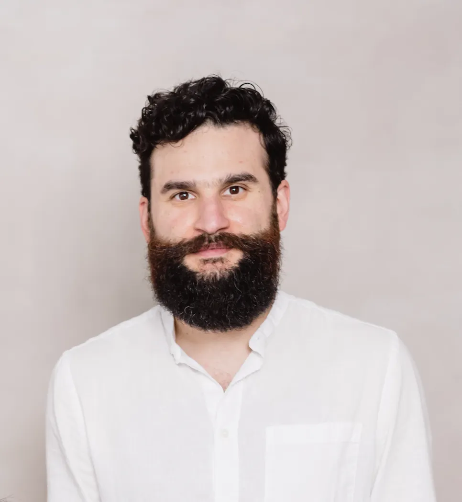
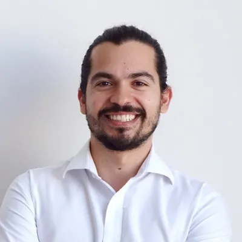

# Manifesto — Icalia Labs

> A manifesto for builders. Since 2012, Icalia Labs has closed the gap between idea and impact — empowering engineers, designers, and founders with AI-augmented craft.

Manifesto

# There is a gap between  
idea and impact.  
We exist to close it.

A manifesto for builders — from Icalia Labs. Since 2012.

The Letter

Monterrey, Mexico

2012 →

There is a gap between idea and impact — not of ambition, but of clarity. Too many products fail because the path from vision to delivery was never properly defined. We exist to close that gap. We are hackers, designers, strategists, and builders, and we believe anyone with a vision deserves a real shot at turning it into something the world can use. Technology is the vehicle; the craft is what makes it land.

We empower the people doing the work. We trust the agent and delegate the process — AI augments the builder, it doesn't replace them. Humans own judgment, taste, and strategy; machines carry the weight of execution. We don't review code line by line; we extend testing based on outcomes, not behaviors. The goal is always bigger, better output from the people who know what they're building and why.

We believe in a world where every product achieves the impact it was meant to have — where knowledge is shared, not gatekept, and where the next generation of builders stands on what we leave behind. That world is productive, abundant, and ready for what comes next. We are Icalia Labs.

Co-founders, Icalia Labs

Still Here

## Founded 2012. Still shipping.

There's never been a better time in history to build software and technology — and we've spent more than a decade earning the right to keep building it.

14+

Years  
in operation

5+

Yr avg  
engineer tenure

100+

Hackers  
engaged

The Code

## Ten principles we live by.

Not aspirational posters. Operating code — used in hiring, delivery, and the conversations we accept or decline.

01

### There is a gap between idea and impact.

Too many products fail not because the vision was wrong, but because the path from concept to execution was never clear. We exist to close that gap.

02

### Anyone with a vision deserves a real shot at building it.

Technology is how ideas reach the world. It shouldn't be gated by complexity or luck.

03

### We are hackers and designers, strategists and builders.

We don't separate thinking from doing. We convert visions into living products.

04

### The people behind the craft matter most.

Engineers, designers, founders, problem solvers — we empower them with better tools, sharper processes, and relentless support.

05

### We trust the agent. We delegate the process.

AI is not a replacement; it is an augmentation of the builder. The best among us wield super intelligence as a natural extension of their craft.

06

### Humans own judgment, taste, and strategy.

Machines accelerate execution. Humans decide what matters, what's right, and where to go next.

07

### We extend testing based on outcomes, not behaviors.

We don't review code line by line. The goal is bigger output, not tighter surveillance. We measure what ships, not what was typed.

08

### We build software in a modern, cohesive, collaborative way.

Old models don't care about outcomes, processes, or people. We do.

09

### Knowledge is a legacy.

We teach the complexities of the intangible so that more people can imagine — and build — at the right scale.

10

### A world where every product achieves its intended impact is a productive world.

That's the world we're building toward. We are Icalia Labs.

What We Refuse

## We are not a body shop.

We don't rent bodies. We don't chase the cheapest labor on the map. We refuse to be called outsourcing, and we refuse to speak about people as though they were interchangeable parts.

Third-world labor arbitrage isn't our pitch. It never was.

Our Language

## Not resources.

Talent. Engineers. Builders. Problem-solvers. Hackers. Designers. Teammates. The words we choose shape the relationship — and ours are chosen on purpose.

Talent Engineers Builders Problem-solvers Hackers Designers Teammates

The 10x Engineer

## Not the Silicon Valley  
myth. Our definition.

"A 10x Engineer is someone who helps others produce more — and takes the time to support them. In the age of agents and generalists, the multiplier isn't individual output. It's what you build in conjunction with others. That's how impact compounds. That's how legacies get made."

How We Work

## Operating beliefs, in practice.

01 — Geography

### Same timezone, same energy.

The unfair advantage of looking south of the border. Cultural affinity, US business hours, real-time collaboration — not overnight handoffs across ten time zones.

02 — Relationship

### Clients are partners.

Our clients own a good part of the relationship with the engineers we place. We support both sides along the way — not as a middleman, but as an invested partner in the work.

03 — Communication

### Written-first. Direct. Async by default.

We write things down. We say what we mean. We frame conversations around outcomes, not activity. Every meeting earns its spot on the calendar.

04 — Horizon

### Built for years, not gigs.

Every engagement is designed for compounding value — not just billable hours. Engineers stay for years because the work is worth staying for. Clients stay because the engineers do.

The People

## The team behind the manifesto.

Each role owns a clear domain. Prospects see a team of leaders, each accountable for a function. Our titles reveal capability — not company size.

Eduardo Lopez De Leon

### Co-Founder & CEO

Strategy, brand presence, and partnership development. Startup and Corp experience. YC Founder.

Abraham Kuri

### Co-Founder & CTO

Head of AI & Technology. Owns the agentic methodology and engineering capability. YC Founder.

Carlos Medellin

### Board Member

Governance, outside perspective, and long-term financial sustainability. Fintech & YC Founder.

Senyi Bojorquez

### Head of Delivery & Infrastructure

Delivery quality across every engagement. One standard, universally applied. Trained by Thoughtbot.

Recognized for the work

Leading AI in LatAm

Clutch recognition — recognized alongside the region's top AI development firms.

Started by YC founders

Supporting technical teams with the Silicon Valley mindset — from founders who've been there.

\> 5,000+ Github stars

Open Source contributions, real code in the wild, engineers who ship where everyone can see.

An Invitation

## This isn't for everyone.

If you're a technical founder, a senior engineer, or a leader who believes the craft still matters — write to us.

[Start the conversation →](contact.html)
